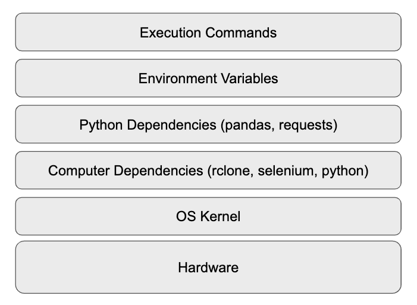
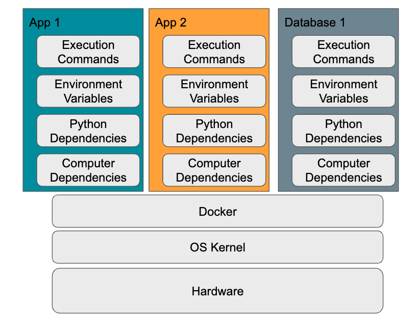
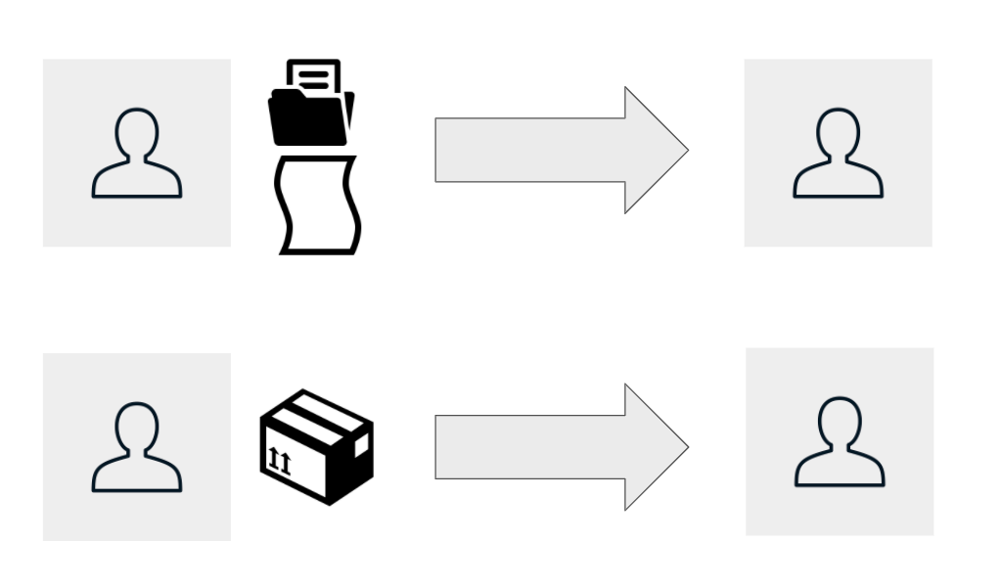

# Docker for Movember Insights

### Sources
https://www.youtube.com/watch?v=fqMOX6JJhGo

https://medium.com/@Joachim8675309/devops-concepts-pets-vs-cattle-2380b5aab313

## 1. Why Docker? Intro to Virtualisation or When "It runs on my computer" isn't good enough

Virtualisation isn't new, It's now just cool

Consider what happens when you run code - you can consider your computer as calling that code in on "Layers"



What happens when these layers are configured differently? If it runs - will it behave the same way?
1. Will your code work across Mac & Windows?
2. Will your code still work on Python 3.7 vs 3.8?
3. What about pandas 1.0 vs pandas 1.1?

Too many unknown, different computers behave in different ways.

Solution is Virtualization - you create a "Sandboxed" environment where you run your code and there are many different tools you can use to do this - Docker is the most popular.



It works by defining Infrastructure as Code - We build what is called a "Dockerfile" which provides instructions on how to setup an environment - from which dependencies to install and how to how to run an application, how including how to enable this container to network with external applications.

These build instructions create what docker calls "Images" and the really interesting bit is how we can have images that inherit from each other

EG The jupyter notebook docker image has many different versions depending on what you need, more advanced notebook with tensorflow & spark setup and simpler notebooks with smaller libraries


We will be building on top of the `python:3.7.9` docker image w

### Benefits
1. Isolation - Application 1 Cannot mess with Application 2 or Database 1
2. Reliability - You know your code will run in different environments


## 2. Installing & Running Docker
[Install it here for mac](https://docs.docker.com/docker-for-mac/install/) then run the following command if you get no error then you're good to go
```bash
$ docker run hello-world
```
## Contents

1. [my first image](my-first-image/README.md)
1. [Interacting with outside world](interacting-with-outside-world/README.md)